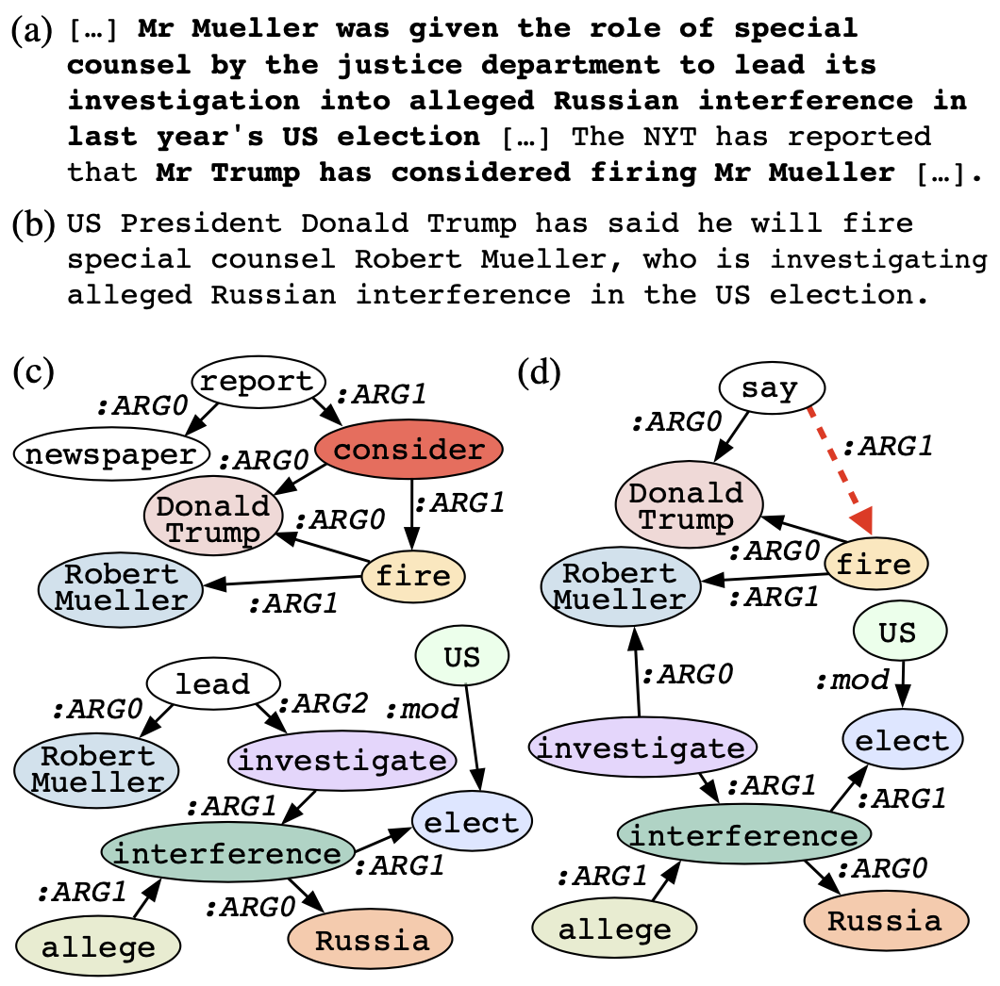
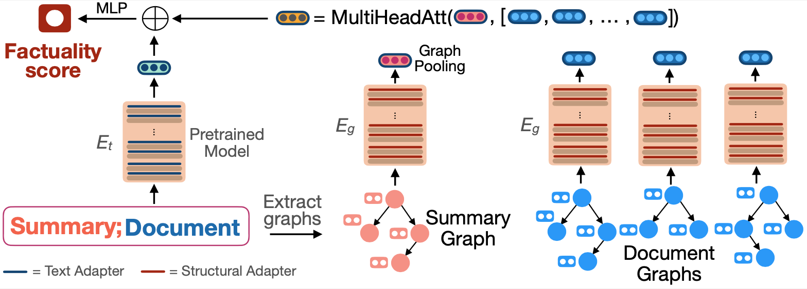

# FactGraph: Evaluating Factuality in Summarization with Semantic Graph Representations (NAACL 2022)

This repository contains the code for the paper "[FactGraph](https://arxiv.org/pdf/2204.06508.pdf): Evaluating Factuality in Summarization with Semantic Graph Representations". 

**FactGraph** is an adapter-based method for assessing factuality that decomposes the document and the summary into structured meaning representations (MR):

<p align="center">

</p>

In **FactGraph**, summary and document graphs are encoded by a graph encoder with structure-aware adapters, along with text representations using an adapter-based text encoder. Text and graph encoders use the same pretrained model and only the adapters are trained:
<p align="center">

</p>
 
## Environment

The easiest way to proceed is to create a conda environment:
```
conda create -n factgraph python=3.7
conda activate factgraph
```

Further, install PyTorch and PyTorch Geometric:

```
pip install torch==1.9.0+cu111 torchvision==0.10.0+cu111 torchaudio==0.9.0 -f https://download.pytorch.org/whl/torch_stable.html
pip install torch-scatter==2.0.9 -f https://data.pyg.org/whl/torch-1.9.0+cu111.html
pip install torch-sparse==0.6.12 -f https://data.pyg.org/whl/torch-1.9.0+cu111.html
pip install torch-geometric==2.0.3
```

Install the packages required:

```
pip install -r requirements.txt
```

Finally, create the environment for AMR preprocessing:

```
cd data/preprocess
./create_envs_preprocess.sh
cd ../../
```

## FactCollect Dataset

FactCollect is created consolidating the following datasets:

| Dataset        | Datapoints |            |
| ------------- |:-------------:|:-------------:|
| [Wang et al. (2020)](https://aclanthology.org/2020.acl-main.450.pdf)     | 953 | [Link](https://github.com/W4ngatang/qags/tree/master/data)
| [Kryscinski et al. (2020)](https://aclanthology.org/2020.emnlp-main.750.pdf)     | 1434 | [Link](https://storage.googleapis.com/sfr-factcc-data-research/unpaired_annotated_data.tar.gz)
| [Maynez et al. (2020)](https://aclanthology.org/2020.acl-main.173.pdf) |   2500  | [Link](https://github.com/google-research-datasets/xsum_hallucination_annotations)
| [Pagnoni et al. (2021)](https://aclanthology.org/2021.naacl-main.383.pdf) |  4942 | [Link](https://github.com/artidoro/frank/tree/main/data)

For generating **FactCollect** dataset, execute:

```
conda activate factgraph
cd data
./create_dataset.sh
cd ..
```


# Running trained FactGraph Models

First, download **FactGraph** trained checkpoints:
```
cd src
./download_trained_models.sh
```

To run **FactGraph**:
```
./evaluate.sh factgraph <file> <gpu_id>
```

To run **FactGraph** edge-level:
```
./evaluate.sh factgraph-edge <file> <gpu_id>
```

`<file>` is a JSON line file with the following format: 
```
{'summary': summary1, 'article': article1}
{'summary': summary2, 'article': article2}
...
```
where `'summary'` is a single sentence summary.

# Training FactGraph

## Preprocess

Convert the dataset into the format required for the model:

```
cd data/preprocess
./process_dataset_for_model.sh <gpu_id>
cd ../../
```

This step generated AMR graphs using the [SPRING model](https://github.com/SapienzaNLP/spring). Check their [repository](https://github.com/SapienzaNLP/spring) for more details.

Download the pretrained parameters of the adapters:
```
cd src
./download_pretrained_adapters.sh
```

## Training

For training **FactGraph** using the **FactCollect** dataset, execute:
```
conda activate factgraph
./train.sh <gpu_id> 
```

## Predicting

For predicting, run:
```
./predict.sh <checkpoint_folder> <gpu_id>
```

## Security

See [CONTRIBUTING](CONTRIBUTING.md#security-issue-notifications) for more information.

## License Summary

The documentation is made available under the Creative Commons Attribution-ShareAlike 4.0 International License. See the LICENSE file.

The sample code within this documentation is made available under the MIT-0 license. See the LICENSE-SAMPLECODE file.


## Citation

```
@inproceedings{ribeiro-etal-2022-factgraph,
    title = "FactGraph: Evaluating Factuality in Summarization with Semantic Graph Representations",
    author = "Ribeiro, Leonardo F. R.  and
      Liu, Mengwen  and
      Gurevych, Iryna and
      Dreyer Markus and
      Bansal, Mohit",
      booktitle = "Proceedings of the 2022 Conference of the North American Chapter of the Association for Computational Linguistics: Human Language Technologies",
      year={2022}
}
```
